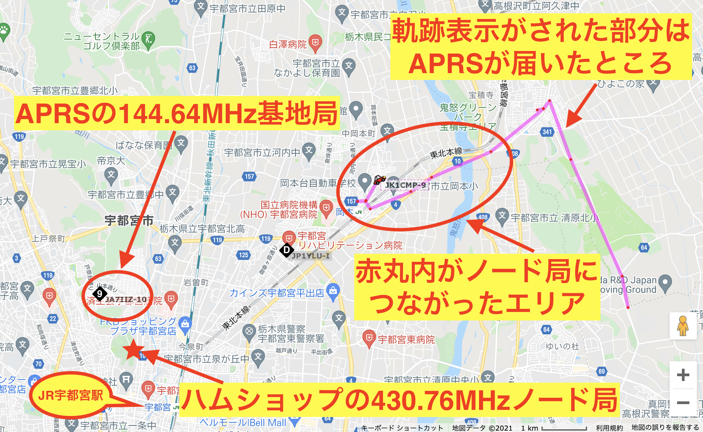
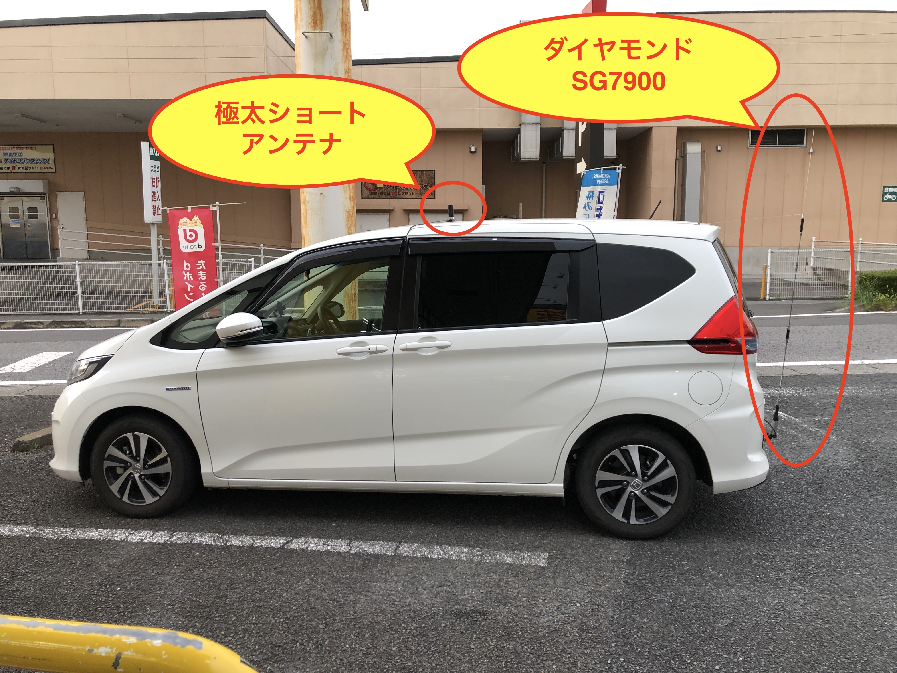
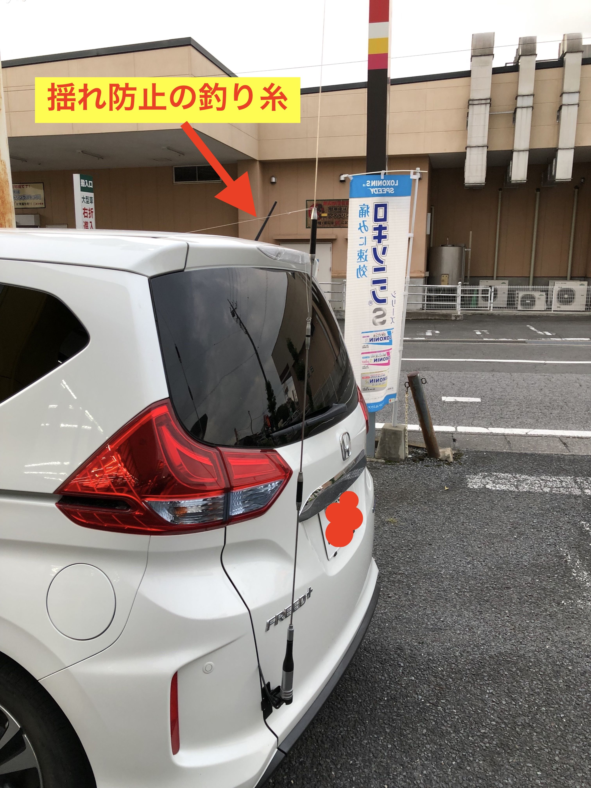
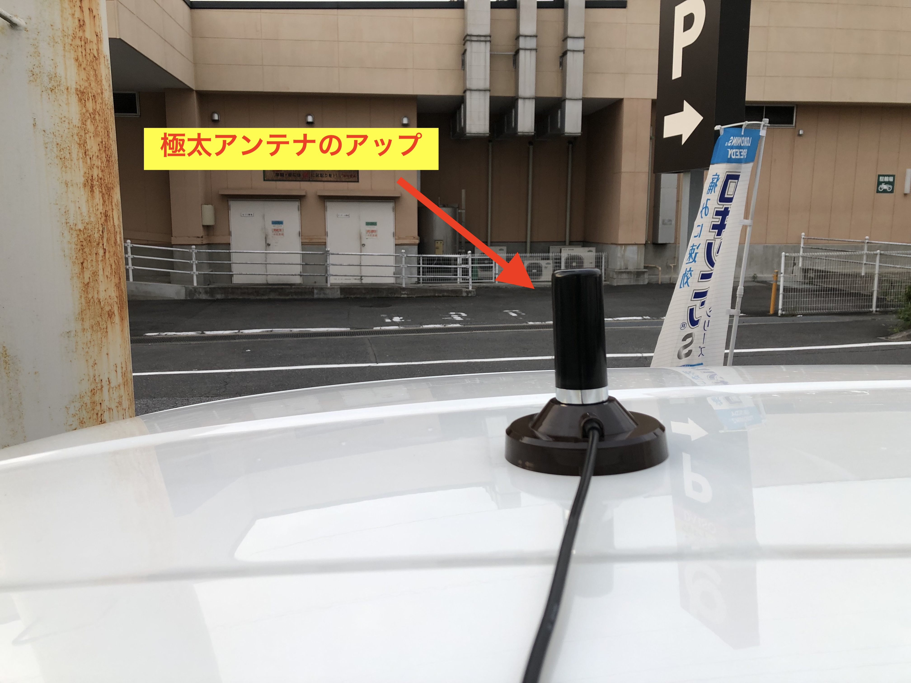
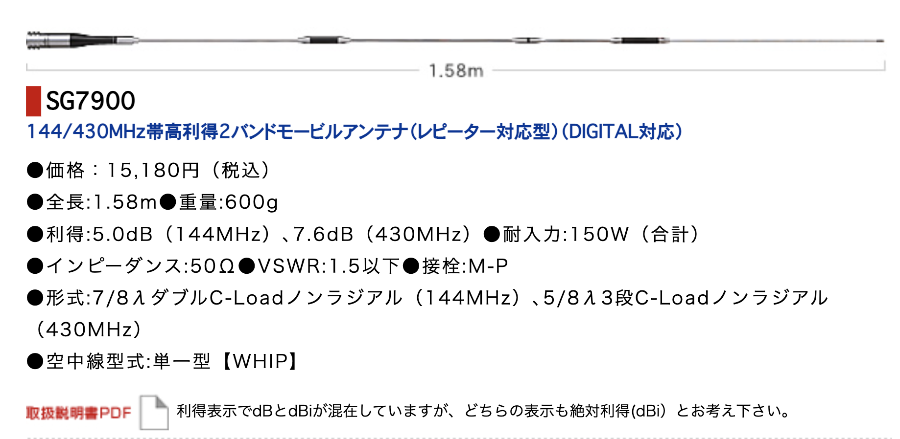
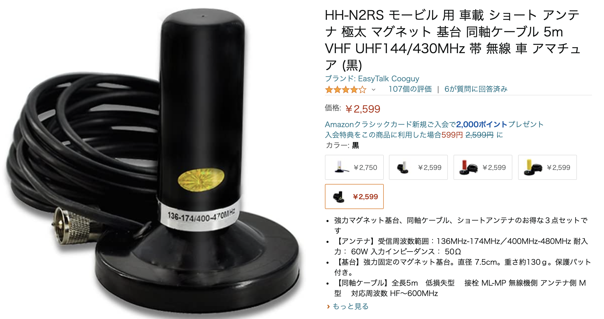

# access-test
<html lang="ja">
 <head>
  <meta charset="utf-8" />
	 

<link href="https://cdnjs.cloudflare.com/ajax/libs/lightbox2/2.7.1/css/lightbox.css" rel="stylesheet">
 
</head>
<body>

  モバイル端末をお使いの場合は、画面を横向きにすると
  より見やすくご覧頂けます。

	
<h1><marquee behavior="alternate">!!! 2021年8月31日(火)栃木県宇都宮市~芳賀郡高根沢町でアンテナテスト !!!</marquee></h1>
	
                                       

<h3>JR宇都宮駅の西側にある、ハムショップのノード局にアクセスしやすいのはどちらのアンテナか、 実験しました。リグはFTM300Dで50Watt送信。 コースは宇都宮から１駅北上した岡本駅から東側の鬼怒川を渡って、南南東に進むルート。 東進、南下側で屋根上のアンテナ、Uターンして、北上、西進側でテールゲートのアンテナを試しました。</h3>

<h3>比較したのは、テールゲートのダイヤモンドSG7900と、最近見かける極太アンテナ。</h3>

<h3>SG7900はやけに長いので、走行中に揺れないように釣り糸で２方向に引っ張りました。</h3>

<h3>極太アンテナは、給電部高さ的には有利な位置にセット。</h3>
	
<h3>SG7900のカタログデータ。</h3>

<h3>極太アンテナのカタログデータ。</h3>

 
<h2>結果はSG7900の圧勝でした。 極太アンテナは全域でノードにアクセス出来ず＆APRSの軌跡を残せずでした。 SG7900は基地局に対して車体の後ろに回った状態でもアクセス出来てました。 Amazonの口コミを見たら、極太アンテナは２mの波が出ないと書かれてます。</h2>
	 
<h2>追加試験</h2>	
<h2>自宅に上げたGPアンテナでハンディー機から波出せるかチェックしました。 物置から引っ張り出したGPはなんと1.2GHz対応で、N型接栓。セットの同軸もやけに太いものでしたが、ハンディー機の5Watt出力で宇都宮のノード局にすんなり接増。 現時点の結論は、車側の空中線が非力・・・給電点高さをなんとか確保すべき！</h2>
	  
<h3>次のテストは、アンテナ角度変えられるマグネット基台で、屋根上に設置しアンテナを前に倒してみますかね〜自衛隊の車がよくやってるやつです。 基台の候補はこれ。</h3>
	

                                       

<marquee direction="left" scrollamount="5" width="85%">以上、ここまでご覧いただき、ありがとうございました！ (^_^)/~hada</marquee>

  

 

<!-- フッタ -->
 <footer>
 Copyright 2021/08/31 S.Hada
	 </footer>
